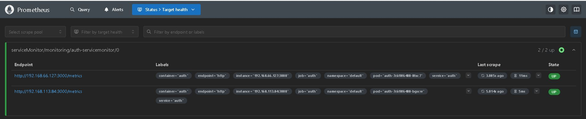
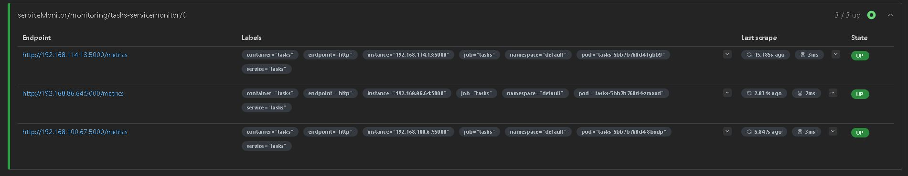
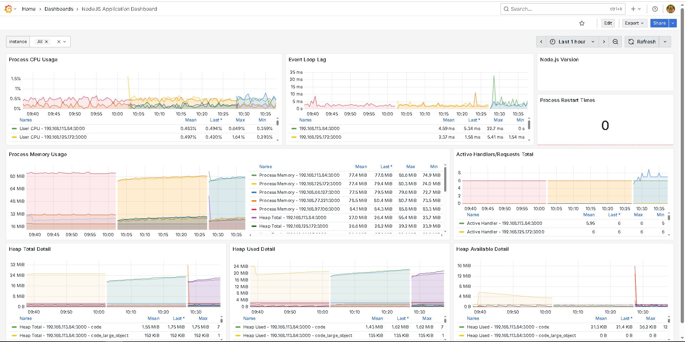
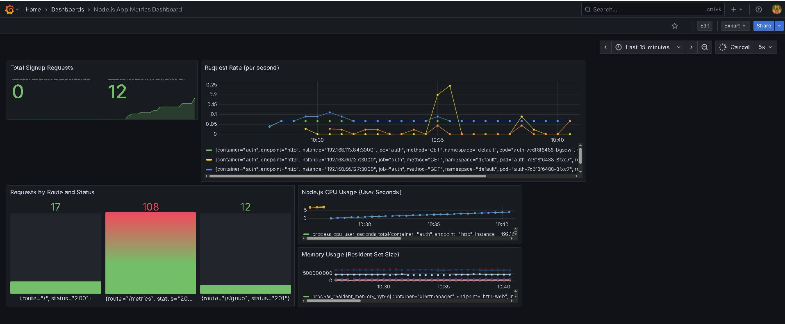

# 🧩 Task Manager — Microservices Application

[](https://www.docker.com/)
[](https://kubernetes.io/)
[](https://prometheus.io/)
[](https://grafana.com/)
[](https://opentelemetry.io/)

---

## 🌟 Introduction

This project is a **complete microservices-based Task Manager application** designed to demonstrate:
- **Service orchestration with Kubernetes (EKS)**  
- **Metrics collection using Prometheus**  
- **Visualization and dashboards using Grafana**  
- **Tracing and observability powered by OpenTelemetry**

Each service (Node.js and Python) exposes its own `/metrics` endpoint, allowing **Prometheus** to scrape real-time data, while **Grafana** provides an intuitive dashboard to monitor application health, performance, and request activity.  
This project represents a modern **DevOps + Observability workflow** for cloud-native microservices. 🚀

---

## 📸 Dashboard Preview

Below are snapshots of how metrics and dashboards appear in **Prometheus** and **Grafana**:

### 🔥 Prometheus Metrics  


<!-- Add Screenshot Here (Prometheus Screenshot 1) -->
<!-- Add Screenshot Here (Prometheus Screenshot 2) -->

### 📊 Grafana Dashboards  


---

## 🧠 Highlights

✅ Microservices architecture (Node.js + Python)
🐳 Fully containerized using Docker
☸️ Scalable Kubernetes (EKS) deployment
💾 MongoDB persistent storage
📈 Real-time metrics via Prometheus
📊 Dashboards with Grafana
🧩 Tracing through OpenTelemetry
🚨 Optional alerting via Alertmanager

---

## 🗂️ Project Structure

```bash
.github/
└── workflows/
    └── deploy.yml          # CI/CD pipeline

auth-service/
├── Dockerfile
├── app.js
└── package.json

tasks-service/
├── Dockerfile
├── app.py
└── requirements.txt

k8s/
├── auth-deployment.yaml
├── auth-service.yaml
├── auth-servicemonitor.yaml
├── tasks-deployment.yaml
├── tasks-service.yaml
├── tasks-servicemonitor.yaml
├── mongodb-statefulset.yaml
├── ebs-sc.yaml
└── ingress.yaml
````

---

## ⚙️ Microservices Overview

| Service           | Language   | Type      | Port  | Description                               |
| ----------------- | ---------- | --------- | ----- | ----------------------------------------- |
| **auth-service**  | Node.js    | ClusterIP | 3000  | Handles user authentication and signup.   |
| **tasks-service** | Python     | ClusterIP | 5000  | Manages CRUD operations for tasks.        |
| **mongo**         | MongoDB    | ClusterIP | 27017 | Stores user and task data.                |
| **prometheus**    | Prometheus | ClusterIP | 9090  | Collects metrics from all services.       |
| **grafana**       | Grafana    | ClusterIP | 3000  | Displays dashboards and metrics visually. |
| **opentelemetry** | Collector  | ClusterIP | 4317  | Aggregates and exports telemetry data.    |

---

## 🧰 Prerequisites

Before deployment, ensure you have these installed:

* 🐳 **Docker**
* ☸️ **kubectl**
* ☁️ **AWS CLI**
* 💻 **Kubernetes Cluster (EKS recommended)**
* 🔎 **Prometheus Operator**
* 📊 **Grafana**
* 🧠 **OpenTelemetry Collector**

---

## 🚀 Deployment Steps

### **Step 1️⃣ — Build & Push Docker Images**

#### Auth Service (Node.js)

```bash
docker build -t <dockerhub-username>/auth-service:v1 ./auth-service
docker push <dockerhub-username>/auth-service:v1
```

#### Tasks Service (Python)

```bash
docker build -t <dockerhub-username>/tasks-service:v1 ./tasks-service
docker push <dockerhub-username>/tasks-service:v1
```

---

### **Step 2️⃣ — Deploy to Kubernetes**

```bash
kubectl apply -f ./k8s/
```

---

### **Step 3️⃣ — Access the Services**

#### 🌐 External Access

Access the **Tasks Service** via the LoadBalancer:

```
http://<LoadBalancer-IP>/
```

#### 🔗 Internal Access (via port-forward)

```bash
kubectl port-forward svc/auth 3000:3000
kubectl port-forward svc/tasks 5000:5000
```

---

## 📈 Monitoring & Observability

### **Prometheus**

Used for metrics collection from `/metrics` endpoints of all services.

```bash
kubectl port-forward svc/prometheus-operated 9090 -n monitoring
```

➡️ Access at [http://localhost:9090](http://localhost:9090)

---

### **Grafana**

Provides real-time visualization and analytics.

```bash
kubectl port-forward svc/grafana 3000:3000 -n monitoring
```

➡️ Access at [http://localhost:3000](http://localhost:3000)

**Suggested Dashboards:**

* Node.js Service Metrics
* Python Flask Metrics
* MongoDB Resource Usage
* Custom Request Counter Dashboard

---

## 🧪 Test It Yourself

You can simulate API traffic and observe metric changes in real time.

**Example Test Request:**

```bash
curl -X POST http://localhost:3000/signup \
  -H "Content-Type: application/json" \
  -d '{"username":"testuser","password":"1234"}'
```

Now open Prometheus and search:

```
http_requests_total
```

You’ll see the count increase after each request — confirming that **metrics are live!**
---
## 🏁 Conclusion

This project demonstrates how to build, deploy, and monitor a **production-grade microservices system** with **modern observability tools**.
It’s a perfect example of combining **DevOps + Monitoring + Cloud-native** design principles.

✍️ *Built with ❤️ using Node.js, Python, Kubernetes, Prometheus, Grafana & OpenTelemetry.*
